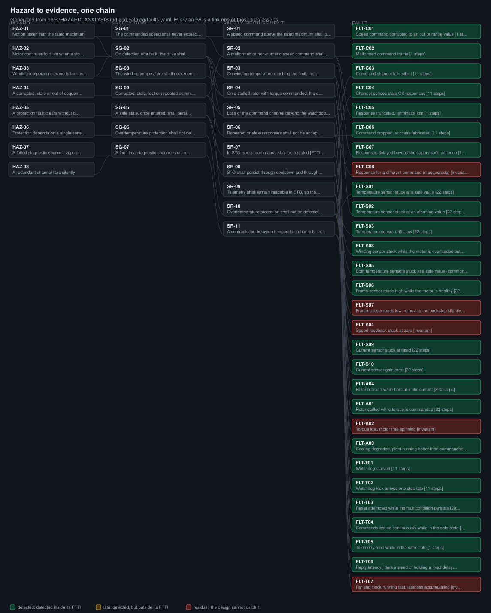
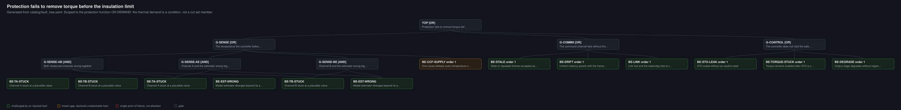

# Fault injection harness

Hazard derived fault injection against an embedded motor controller, producing a
requirement to test traceability matrix and a fault coverage report with
detection latency measured against a fault tolerant time interval budget.

Communication faults are additionally run through a CRC, counter and timeout
protection layer configured as **both AUTOSAR E2E and PROFIsafe**, and the two
are compared on the same fault set.

> **This models the mechanism, it does not implement either standard.** The CRC8
> uses the SAE J1850 polynomial `0x1D`, which is correct for E2E Profile 1, and
> the same 8-bit CRC is reused for the PROFIsafe configuration. Real PROFIsafe
> uses a wider CRC and a 24-bit consecutive number over its F-Parameters. What
> is being compared here is the behaviour of a CRC plus counter plus timeout
> scheme under injected faults, not conformance to either specification. See
> "What this is not" below.

```
29 faults   24 detected in time   0 detected late   5 residual   5 catalogued pairs
323 tests   100% branch coverage   ruff + mypy strict   every figure here gated in CI
3 of 11 safety requirements currently NOT met, each named with why
```

## The whole argument, on one picture



Hazard, safety goal, safety requirement, fault, and the FTTI budget each one is
judged against. Until now that chain was spread across `docs/HAZARD_ANALYSIS.md`,
`docs/SAFETY_ARGUMENT.md` and `report/traceability.md`, so seeing that any
particular hazard is answered by anything at all meant reading three documents
side by side. It is the intellectual contribution of the repository and it was
the one thing not on a page.

**It is generated, not drawn**, by `scripts/render_chain.py`, from the same
loaders the campaign uses. Every arrow is a link one of those files asserts:
a goal connects to a hazard because the goal's own row names it, and a fault
connects to a requirement because the fault's `challenges` list names it.
`scripts/check_docs.py` regenerates the SVG and compares, so a stale diagram
fails the build. That check exists because this repository has already been
bitten by the drawn-once version of the same problem: for four weeks this
README claimed a test count 21 short of the real one while the docs gate failed
on it, and a number in a README at least gets read. A picture is never diffed.

(The gate caught this paragraph too, on its first draft, because quoting the
old figure reads as claiming it. That is the check being right rather than
annoying, so the sentence was reworded instead of the rule being loosened.)

Faults are coloured by their **catalogued expectation**, not by the last run:
green detected inside its FTTI, amber late, red residual. The picture states
what the argument claims; `report/coverage.md` states whether the claim held.
Colouring by live result would make the same committed diagram mean different
things on different days.

## What this is for

There is a version of "fault injection" that means generating training data for a
classifier, and a version that means generating evidence. This is the second one.
The deliverable is not an accuracy figure, it is a traceability matrix, a
coverage report, and a written argument about what the design does not do.

Three properties are worth more than the fault count:

**The faults are derived, not listed.** Every entry in `catalog/faults.yaml`
traces to a safety requirement in `docs/HAZARD_ANALYSIS.md`, which traces to a
safety goal, which traces to a hazard. A fault that challenges nothing fails the
build.

**Detection alone is not a pass.** Each fault carries an FTTI budget and the
report judges latency against it. Noticing a fault after the hazard has occurred
is not a safety mechanism.

**The gaps are named.** Five of the twenty nine faults are residual: the design cannot
detect them. Each one records what design change would be needed, and one of them
exists specifically to stop a fix being oversold. A campaign reporting complete
detection would not be credible.

## The headline finding

**The obvious fix for a sensor you cannot trust is a second sensor. It was the
wrong fix**, and the campaign proved it three separate ways before a channel of a
different *kind* closed all three.

The same fault, a winding sensor stuck at a safe value with the rotor stalled,
against four successive designs:

| Design | Trip | Peak winding |
|---|---|---|
| One temperature sensor | **never** | ran away |
| Two sensors, with a cross check | late | past the limit |
| Two sensors, frame channel latently dead | **never** | ran away |
| Two sensors plus an accumulated overload channel | **step 2** | **51.6 C** |

Budgets are **derived and differ by condition**: 22 steps for a locked rotor,
136 for a sustained 2x overload, 1041 for cooling degraded to a third of nominal.
A fault judged on a budget looser than its requirement is the easiest way to
inflate a coverage report, and the traceability gate refuses it.

**Why a different kind, and not a third sensor.** The third channel does not
measure temperature; it integrates current above rated. Anything that defeats
measurement defeats every channel that measures, so a third thermometer would
have closed none of these:

| Fault | Two sensors | With the overload channel |
|---|---|---|
| Winding sensor lying | late, past the limit | step 2 |
| **Both** sensors lying (common cause) | never detected | step 2 |
| Lying sensor plus latently dead frame | never detected | step 2 |

**The sharpest result is why the first attempt failed.** A predicted-temperature
channel looked right and passed every test, and was only passing because its
model shared the plant's coefficients. A class 155 machine at a 100 K rated rise
runs at **87% of its absolute insulation limit**, so solving the bounding
constraints gave a tolerable prediction error of **0.00%**. An accumulator sits
at *zero* during rated duty instead, and tolerates about +7% over-reading and
46 to 75% under-reading. Real drives protect this way for exactly this reason.

**What it costs.** The overload channel knows only what was commanded, so a
degraded plant leaves it at exactly zero and only a measurement notices. Neither
kind is sufficient; the pair covers two disjoint failure classes. That is what
diversity means, and it is why the fault the channel *cannot* see is catalogued
even though it passes.

**And something still gets through.** Combining both blind spots, a mild cooling
degradation plus a lying winding sensor plus a dead frame channel, still drives
the winding past its limit undetected. That is three faults, so the harness cannot
express it as a pair, and it is written into the safety argument rather than left
to be found.

## Three outcomes, not two

A design can detect a fault and still fail to protect against it, so the catalog
distinguishes **detected**, **detected but outside budget**, and **residual**.
Collapsing the first two is how a coverage report ends up describing a drive that
burns out.

Requirement satisfaction is a **universal** claim: satisfied only when *every*
fault challenging it is detected inside its budget. The weaker existential rule
was in place first and scored SR-10 as satisfied while a sensor stuck at ambient
let the winding reach 207 C.

## The cross domain comparison

`src/fih/protection.py` implements one CRC plus counter plus timeout mechanism
and configures it two ways, because AUTOSAR E2E and PROFIsafe are the same idea
in different vocabularies. Against corruption, repetition, loss and delay they
behave identically, and both refuse the frame **nine steps earlier than the bare
protocol's watchdog managed**, before the payload ever reaches the device.

They disagree on exactly one fault, and the disagreement is real rather than an
implementation artifact:

| | E2E | PROFIsafe |
|---|---|---|
| FLT-C08, a valid reply about the wrong quantity | detected, `WRONG_ID` | **not detected** |

An E2E Data ID identifies a *data element*, so a reply carrying a temperature has
a different Data ID from one carrying a speed. A PROFIsafe F_Destination_Address
identifies a *device*, so every message on the link carries the same one and the
reply passes every check. Under PROFIsafe, binding a response to its request is
an application layer job.

`docs/STANDARDS_MAPPING.md` carries one requirement, SR-05, through both stacks
side by side.

## Layout

```
docs/HAZARD_ANALYSIS.md      8 hazards, 7 safety goals, 11 safety requirements with FTTI budgets
docs/SAFETY_ARGUMENT.md      claim, evidence, and at length what is NOT claimed
docs/STANDARDS_MAPPING.md    one requirement through the automotive and industrial stacks
catalog/faults.yaml          the 29 faults, as reviewable data rather than code
src/fih/campaign.py          one fault per run, deterministic, records what the device did
src/fih/report.py            judges those runs against the budgets
src/fih/traceability.py      bidirectional gate; fails the build on a gap either way
src/fih/protection.py        the shared mechanism, two profiles
report/                      generated evidence, rebuilt and checked on every push
```

## Running it

```sh
uv run --group dev pytest                       # the catalog driven suite
uv run --group dev python scripts/build_report.py   # regenerate report/
```

The device under test is **imported, not copied**: it is
[`embedded-test-automation`](https://github.com/MKamel7/embedded-test-automation)
pinned to tag `v3.1`. Both halves of that matter. Copying would fork the thing
being verified, so the evidence would no longer refer to the original. Tracking
`main` would let the device's thresholds move underneath a published coverage
report, and that has happened at every release: the overheat trip moved, a second
temperature channel appeared, the thermal model was validated and corrected, and
a third channel replaced the second. Each arrived as a deliberate repin with the
evidence regenerated, rather than as a silent shift under a published report.

## The FMEDA, and the wall next to it

`catalog/fmeda.yaml` is an **educational** FMEDA over a **hypothetical** bill of
materials. **Every failure rate in it is invented.** Nothing computed from it
says anything about any real device, and no ASIL claim follows from it. It is
here because being able to do the arithmetic is worth demonstrating, and because
being honest about what a real one would need is worth demonstrating too.

| | |
|---|---|
| **SPFM 93.8%** | against the ASIL D target of 99%, which it does **not** meet |
| **LFM 87.9%** | against the ASIL D target of 90%, which it does **not** meet |
| **16 modes** | 725 FIT total, of which 690 safety related and 35 safe |

A synthetic analysis that happened to clear every target would be the least
believable possible outcome, so the shipped numbers are reported as they fall
and `test_fmeda.py` asserts they still miss.

> **"Residual" means two different things in this repository, and the docs gate
> caught them colliding.** In `catalog/faults.yaml` a *residual fault* is one the
> design cannot catch at all, catalogued deliberately with the change that would
> close it: there are **five**. In ISO 26262-5, a *residual fault* is the
> uncovered fraction of a failure mode that DOES have a safety mechanism, which
> is a rate rather than a count. They are not the same idea and this note is
> here so nobody adds them together.

**The largest single-point contributor is FM-CO-03, uniform latency growth with
the frame sequence intact.** That is the same gap the campaign found from the
other direction, by injecting FLT-T07 and watching a counter and timeout fail to
see it. One route is qualitative and one is rate-based, they were built
independently, and they agree. A test asserts they keep agreeing, because if the
two ever diverge one of them is wrong and it matters which.

### The distinction that is easy to lose

    detection coverage    24 of 29 injected faults caught. MEASURED, and a
                          statement about the contents of catalog/faults.yaml.
    diagnostic coverage   the fraction of a failure mode's RATE a mechanism
                          detects. ASSUMED, and an INPUT to the FMEDA.

A campaign cannot produce a DC number: it samples a fault list somebody wrote,
while DC integrates over a rate distribution. Letting "we caught 24 of 29"
become "diagnostic coverage is 83%" is the kind of sentence that reaches a
safety case and is not true.

What the campaign legitimately does is **falsify**. Every mode claiming
`diagnostic_coverage > 0` must name at least one injected fault that challenges
its mechanism, and the build fails if it names none, because a coverage figure
nobody has ever tested is an assumption wearing a number. That traffic runs in
one direction only. Modes that claim nothing, like the watchdog that cannot be
observed failing on its own, need no fault and are the honest latent case.

## The fault tree, and what it found



The traceability chain proves every injected fault descends from a hazard:
nothing is injected because it seemed interesting. It cannot prove the converse,
that every **way the hazard can happen** has been attacked, because it only ever
walks outwards from faults that already exist. A fault tree starts at the top
event and decomposes downwards, so its minimal cut sets are a list the campaign
can be held against. One artefact justifies what is there; this one looks for
what is missing.

| | |
|---|---|
| **10 basic events** | 10 minimal cut sets: **7 of order 1**, 3 of order 2 |
| **6 of 7** single points of failure | challenged by an injected fault |
| **1 of 7** | `BE-CCF-SUPPLY`, declared unattackable by this harness, with the reason |
| **3 order-2 cut sets** | **none attacked by the dual-point campaign.** An open finding |

### The result worth reading

**`BE-CCF-SUPPLY` is an order-1 cut set.** Redundancy shows up in a fault tree as
order-2 cut sets: two channels have to fail together, which is exactly what the
2-of-3 majority over channels A, B and the estimator buys. A common cause, a
shared supply rail or a shared thermal path, defeats all three at once and
therefore sits at **order 1**. The majority vote buys nothing against it.

That is why a redundant design can still have a single point of failure, and it
is invisible in the traceability chain, which sees three healthy channels each
with faults attacking them. Closing it is an architecture question, independent
supplies and diverse sensing elements, not a test question, so it is declared
rather than quietly absent.

**The tree also found three double failures nobody has attacked**, all in the
sensor branch: A with B, A with the estimator, and B with the estimator. The
five catalogued pairs in `catalog/dual_point.yaml` all involve `FLT-S07` or
`FLT-S09` and none of them covers these. That gap is recorded, not closed by
inventing pairs, and a test holds it at exactly three so it cannot grow quietly.

### A modelling error worth recording

The first version of this tree made the top event `AND(heat is generated,
protection fails)`. That is true as a sentence and useless as a tree: every cut
set then contains a demand event, every order rises by one, and there are **no
order-1 cut sets at all**. The single-point-of-failure gate passed while
guarding nothing, which is precisely the shape of check this repository argues
against everywhere else.

The demand is a **condition**, not a fault, which is also how IEC 61508 and ISO
26262 treat it: the operating condition under which a safety function is
required, not a failure of it. The tree is now scoped to the protection function
**on demand**, the demand is recorded separately so it stays visible, and order 1
means what it is supposed to mean. A test asserts the demand events are not in
the cut sets.

## Roadmap

Timing faults landed on 31 August and the result is in the table above: **jitter is caught, drift is not.** FLT-T07 is now a documented residual, because a counter and timeout pair cannot see uniform latency growth. Every frame is individually perfect, the consecutive number is exactly one more than the last, and it arrives before the timeout; what is wrong is the relationship between the frame sequence and real elapsed time, and neither a checksum nor a counter carries any information about that. Closing it needs a timestamp in the protected frame, which is a change to what the frame carries rather than to the checks over it.

- **Implement PROFIsafe properly and delete the caveat.** The 8-bit CRC currently stands in for a scheme that really uses a wider CRC and a 24-bit consecutive number over its F-Parameters. It is the only asterisk on the headline claim.

Not doing: **renaming this to a "Framework".** It breaks every link and claims more than "harness" does, which cuts against the accuracy discipline that makes this worth reading. And not chasing 100% detection: four faults are residual by design, each recording what would be needed to catch it.

## What is not claimed

No conformance, no certification, no ASIL and no SIL. ISO 26262, IEC 61508,
IEC 61800-5-2, IEC 61784-3 and Automotive SPICE are paid standards and
conformance is an assessor's judgement. This work is *structured per* and *mapped
to* their concepts.

The figure computed here is **detection coverage over the injected fault set**,
which is a statement about this catalog. It is **not** diagnostic coverage in the
ISO 26262 sense: that requires an FMEDA with component failure rates in FIT, and
there are none for this design. `catalog/fmeda.yaml` computes the ISO 26262-5
metrics over a **hypothetical bill of materials with invented rates**, which
demonstrates the arithmetic and describes nothing real. Latencies are in **simulation steps**, never seconds,
because the device's thermal time scale is deliberately compressed.

**It has been independently reviewed, and not independently assessed.**
`docs/REVIEW.md` records three rounds, including a reviewer at TU Munich who
found that the overload channel had no current sensor and therefore privileged
access to the plant, which made the headline diversity result partly
self-fulfilling. Two earlier model reviews had missed it.

What remains open is a qualified assessment, meaning a judgement by an assessor
against a standard. Both ISO 26262 and IEC 61508 scale required independence with
ASIL or SIL, for the reason that the author of a hazard analysis is the person
least able to notice the hazard they did not think of. Review narrows that gap.
It does not close it.

The work is **well verified and essentially not validated**. Verified: the
harness does what it claims, reproducibly, with the evidence regenerated and
staleness-checked on every push. Not validated: the device is a model that has
never been compared to a real drive, and its thermal time scale is deliberately
compressed, so every latency is internally consistent and externally meaningless.

`docs/SAFETY_ARGUMENT.md` sections 5 and 6 give the full account, including the
four occasions where an expected result was revised after observing the actual
one.
